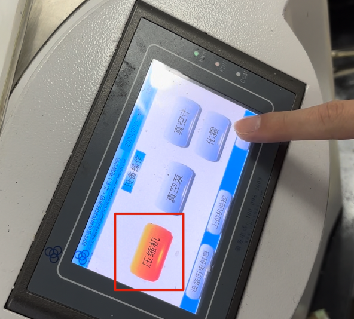
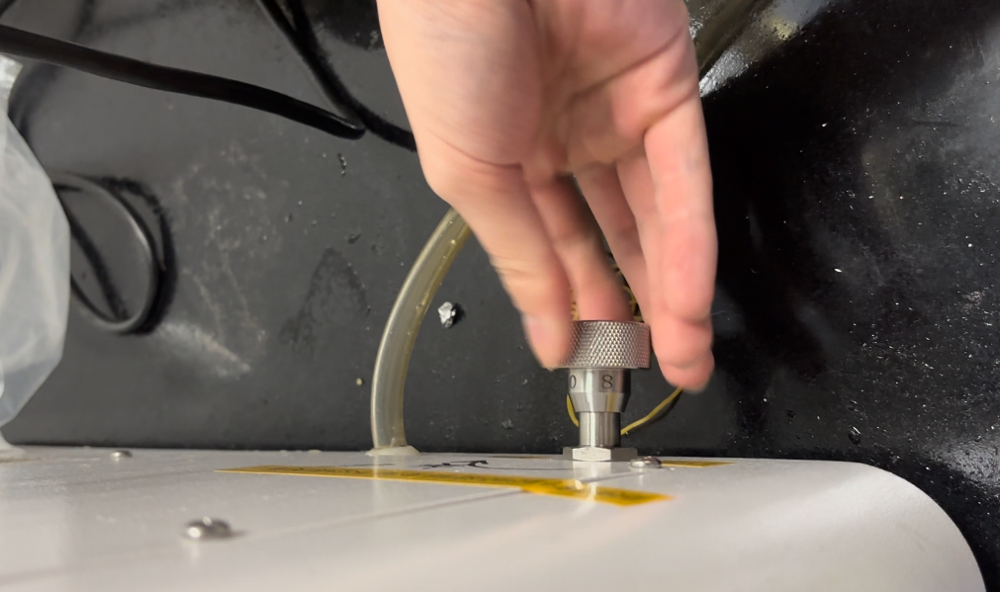
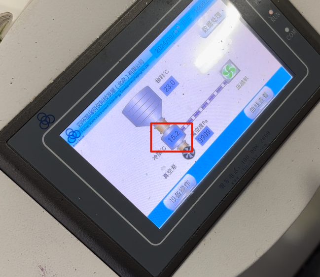
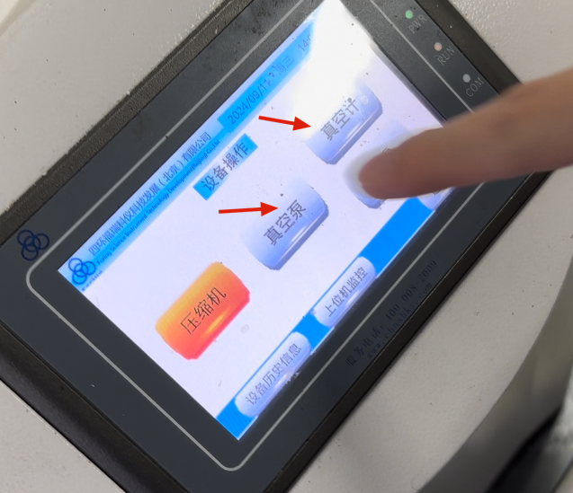

# 开机
按一下屏幕右手边按钮开关，指示灯亮即开机，屏幕开始亮，在屏幕空白处点击进入界面。
# 压缩机制冷
点击压缩机，显示红色表明开启（pic1），有很大的噪音。

# 拧紧阀门
拧阀门至无法拧动（pic2）。

# 放置样品
等温度降至-60至-70°C (pic3)，然后放样品，把强化玻璃罩放好。

# 打开真空泵和真空计
点击打开真空泵（pic4），开始抽真空。等待真空度达到500以下（pic5），说明设备气密性没有问题，可以离开让仪器工作。

