## 注册XCMS网站
网址：[https://xcmsonline.scripps.edu/landing_page.php?pgcontent=mainPage](https://xcmsonline.scripps.edu/landing_page.php?pgcontent=mainPage)
{}
最好使用edu的邮箱，否则不好注册。
{}
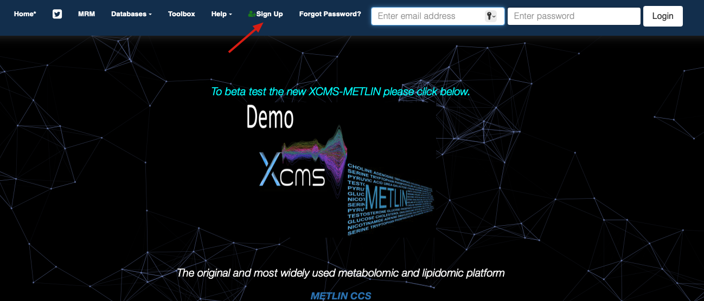
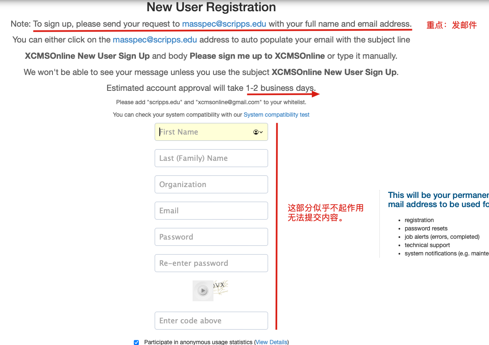

## 新建任务
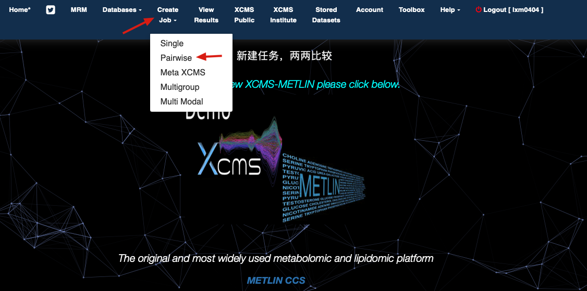
- 查看可之间上传的文件格式
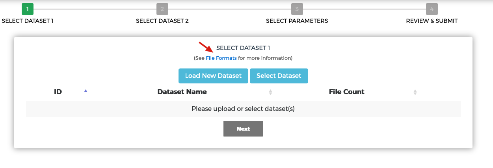

## 可上传的数据格式
若不满足以下数据格式，可使用[ProteoWizard](http://proteowizard.sourceforge.net/downloads.shtml)进行转换。
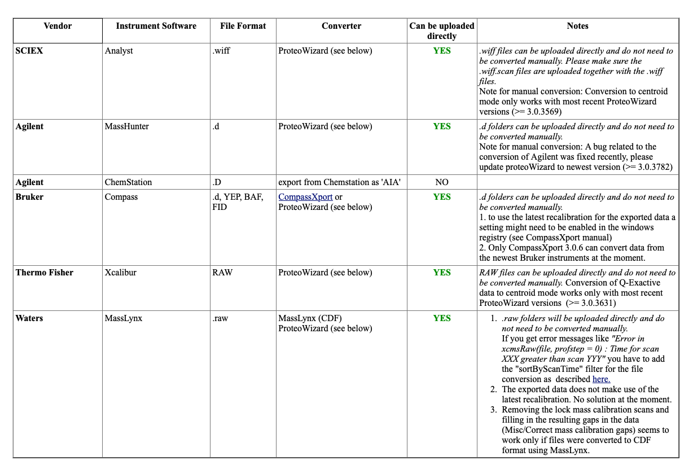
Ailgent的数据格式`.d`需要进行转换，通常可以将其转换为`.mzxml`。否则是无法整个上传，会将文件夹中的所有文件分开上传。转换后数据如下：
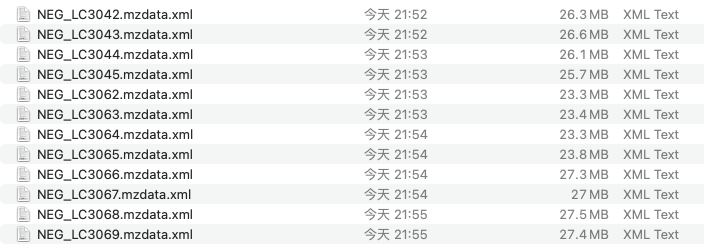
{}
转换方法详情见文章[MSconvert](https://lxmic.netlify.app/post/msconvert/)
{}

## 上传需要比较的文件
### 先上传对照组，生物学重复一起上传

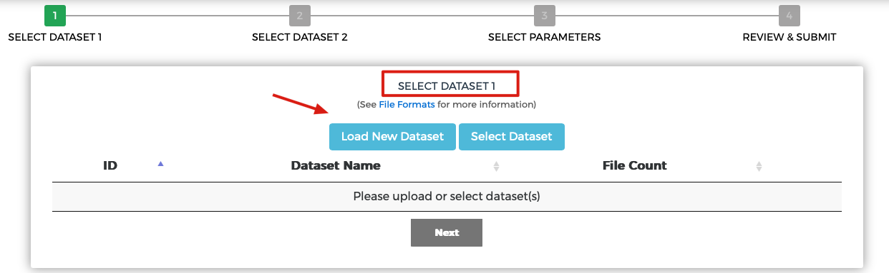

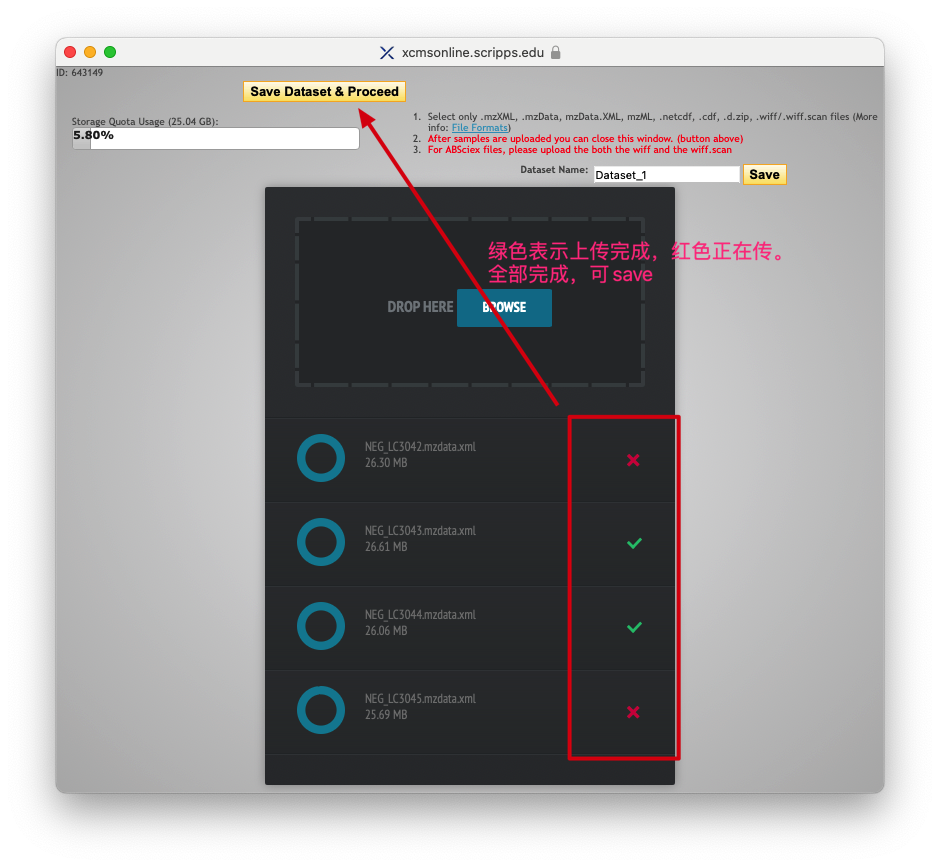
上传了数据集1共4个文件,点击next
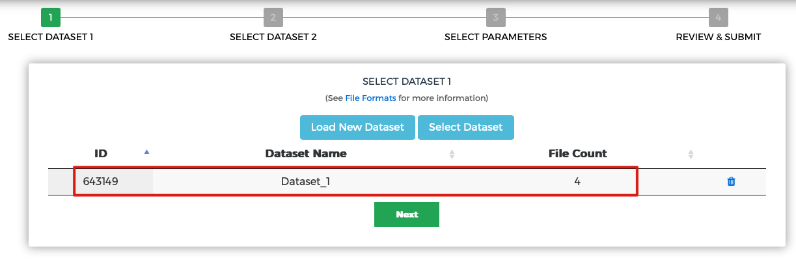

### 上传处理组
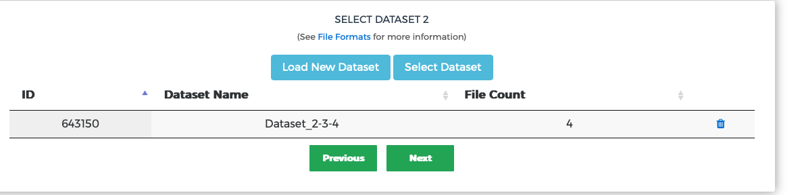

### 选择参数
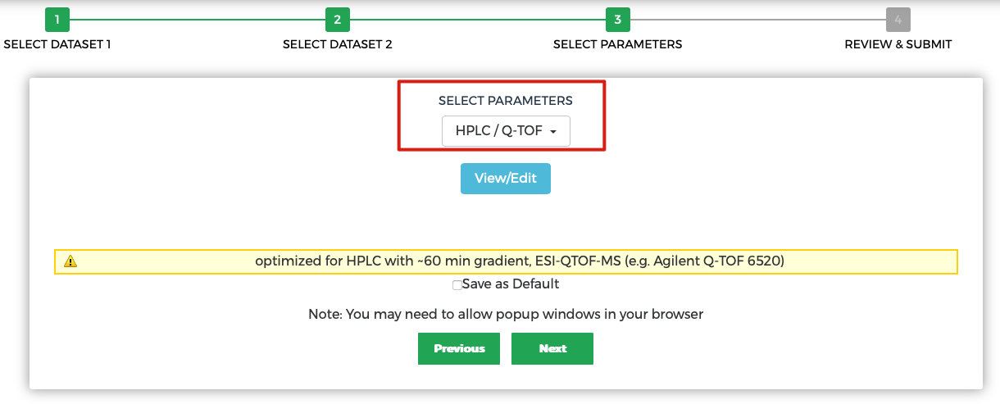

### 修改项目名，点击submit
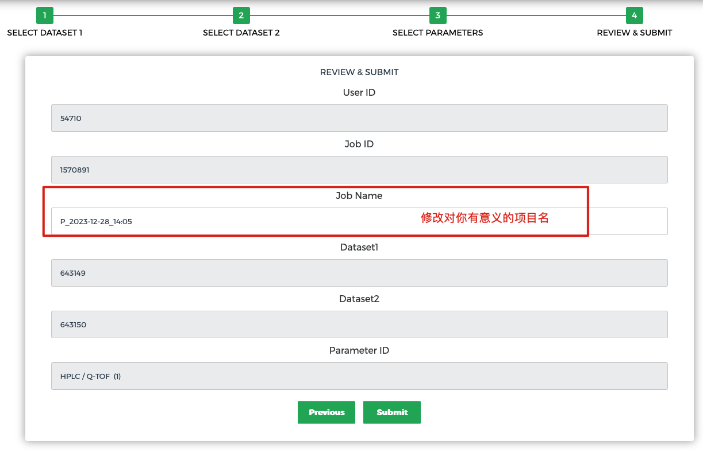

## 查看进展
提交完会直接跳转到改进展页面，也可以在`View Results`中看处理结果。
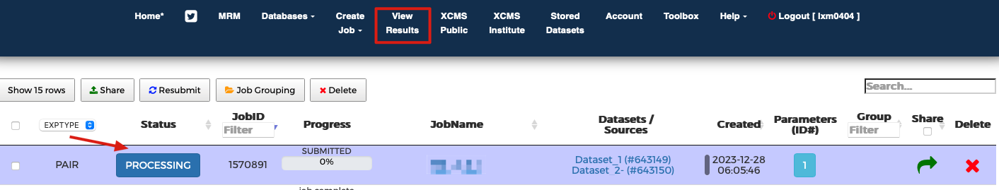
过一段时间刷新后，可看到已经处理45%
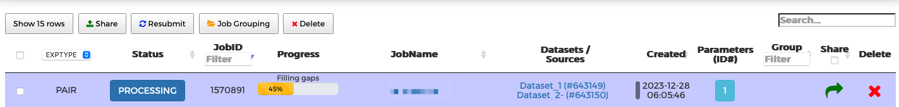

## View分析之后的结果
点击view

可以看到这些结果
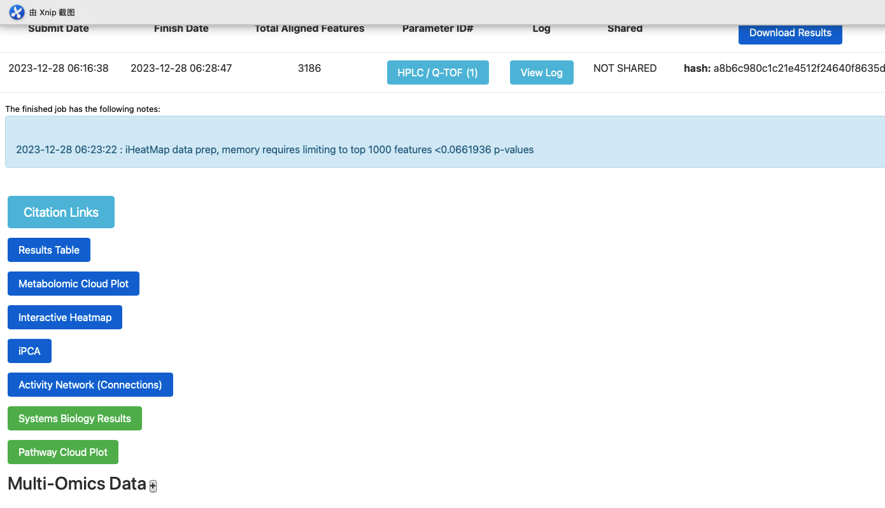
## 点击metabolic cloud plot
图中绿色的代表含量显著升高；红色代表显著下降。
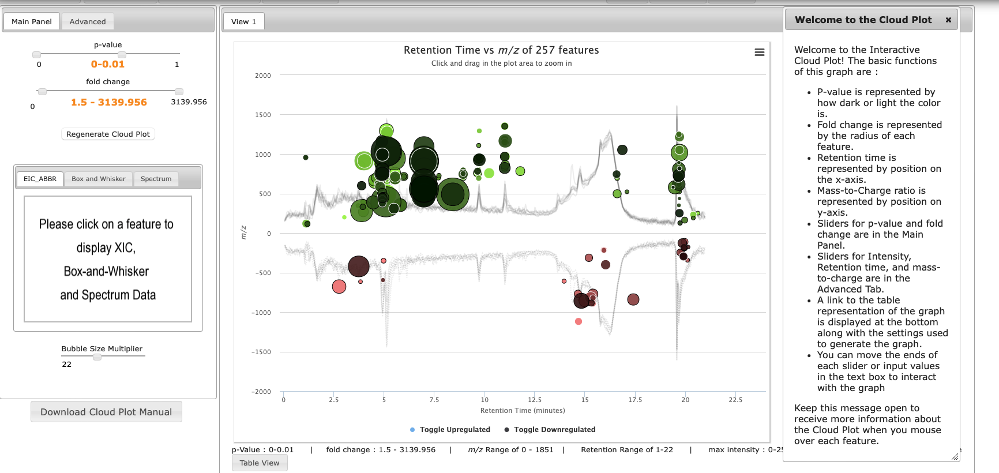
可以将云图下载为png，jpeg，或者svg矢量图。
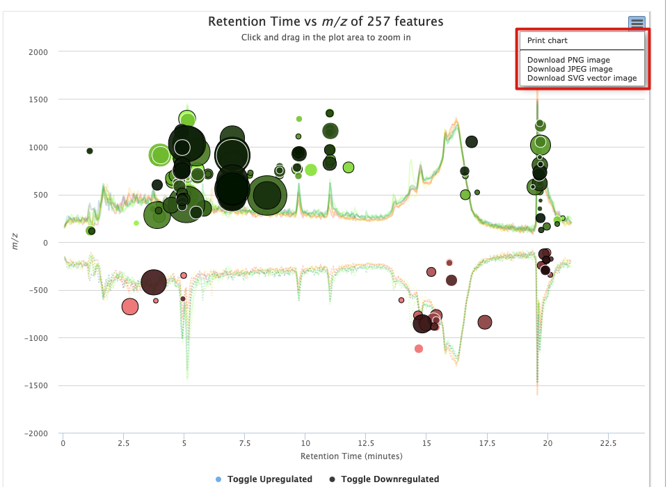
## table view
点击箭头处的按钮，进入列表模式，看到左右显著变化的物质。
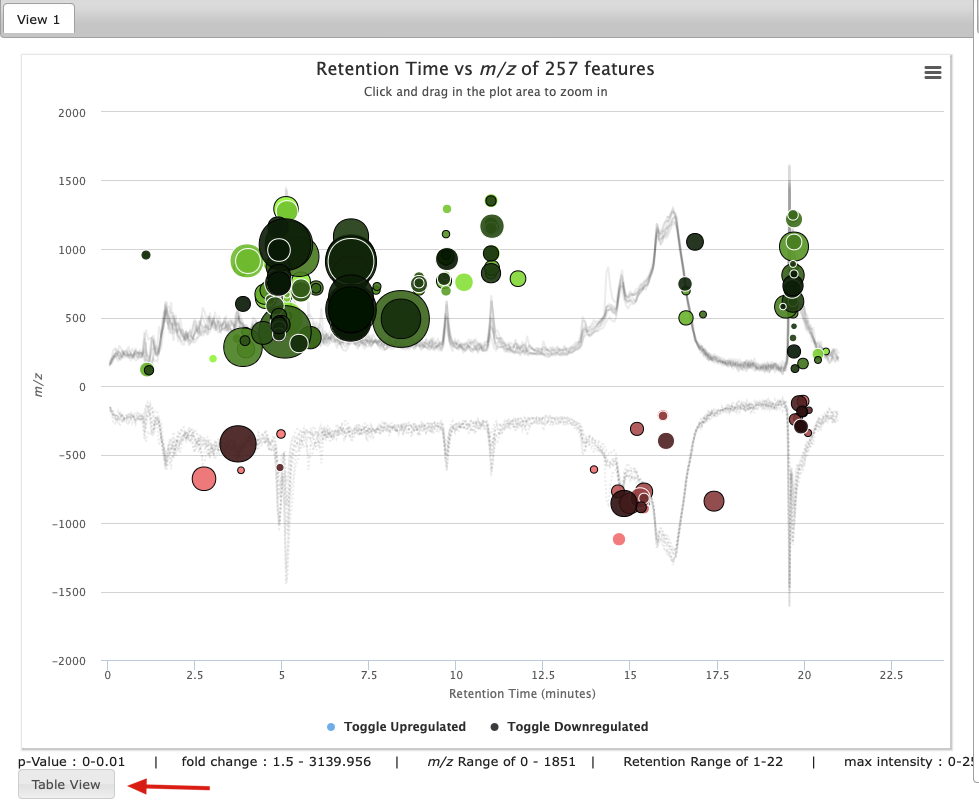

列表信息显示很多参数，fold，up or down, RT and so on.可以点击下载表格，进行进一步分析。
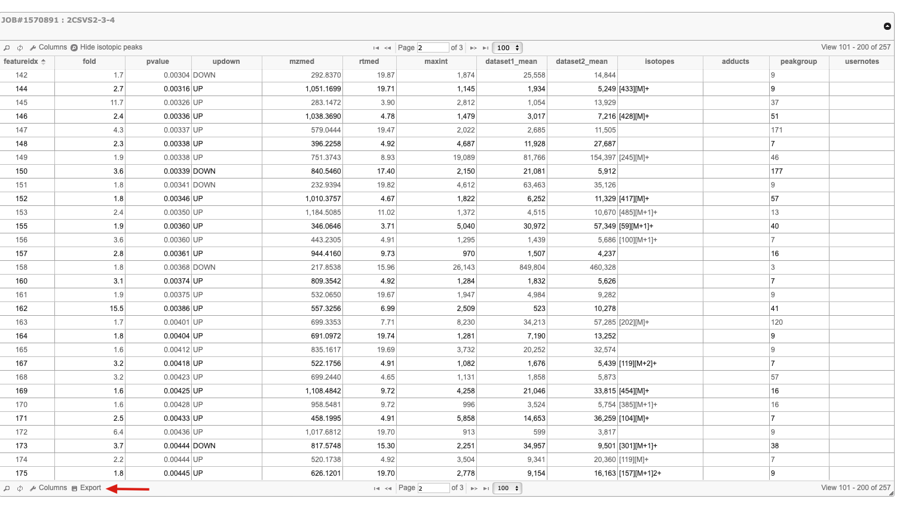

点击表格上的行可以再表格右边显示feature详细信息，包括EIC和MS spectrum，以及最右下角可能物质的展示。
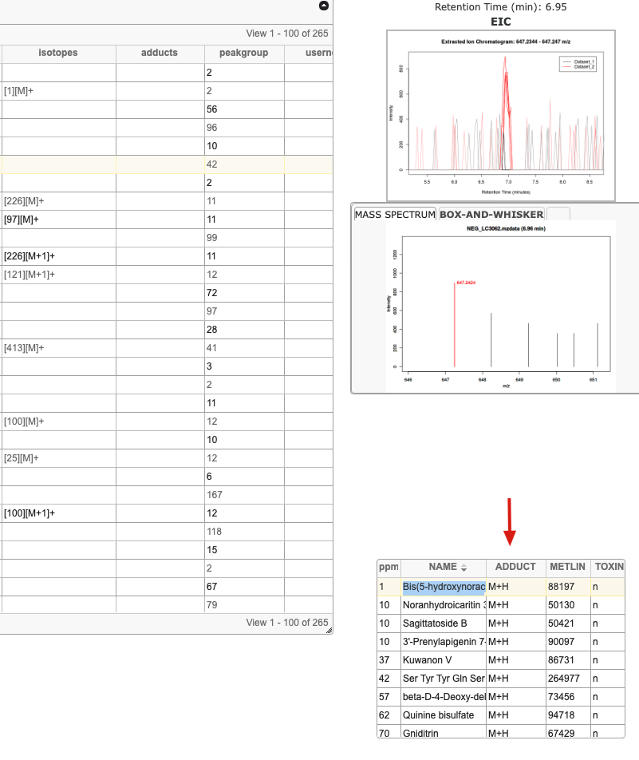

{}
对某些物质进一步分析，用MassHunter工具分析，根据二级质谱推测可能的物质结果。
{}