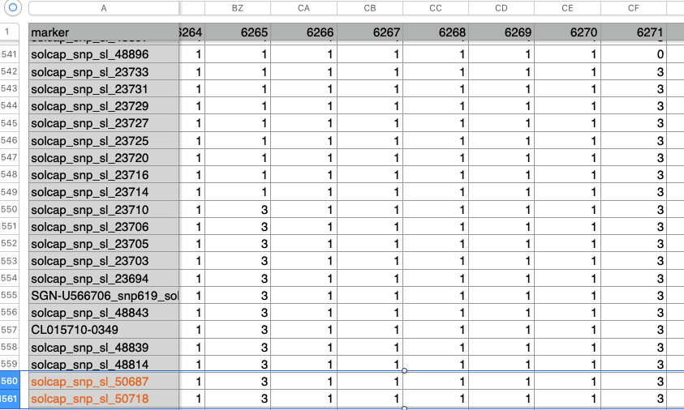
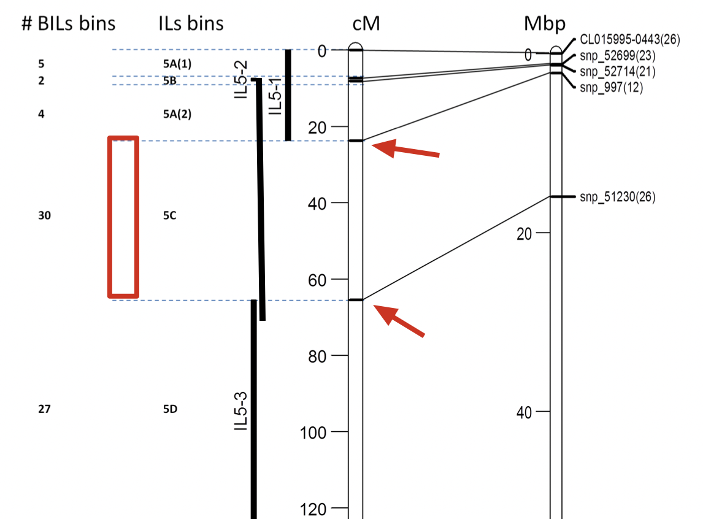

# 番茄ILs和BILs群体构建
ILs主要是通过LA0716和M82杂交，然后重复回交，最终染色中含有LA0716单一染色体片段。目前，使用的ILs有76个，覆盖了整个番茄基因组，图中A图的黑色线段就是LA0716的染色体片段。这些ILs，为QTL鉴定作出了重要的贡献。

BIL是通过LA0716和M82杂交，然后与M82回交2-3代，最后自己8代，最终得到染色体中有多个LA0716片段，且片段更小，图中为BILs构建的过程。目前，BILs的数量为466个line，相比ILs，能够更精细的确定性状相关区域。

{}
The population of backcross inbred lines (BILs) is composed of 446 lines derived after a few generations of backcrosses of the wild species (*Solanum pennellii*; LA0716) with cultivated tomato (cultivar M82; LA3475), followed by more than seven generations of self-pollination (Ofner et al. 2016) 
{}

# 番茄ILs和BILs的主要区别示意图

# 如何确定目标基因所属的ILs和BILs
换种说法，就是SP基因在M82中表达，有点类似在M82中做了转基因，使其表达SP基因——即寻找包含目标基因的ILs和BILs。

### 1. 找到目标基因染色体位置
可以在[Sol网站](https://solgenomics.sgn.cornell.edu/)中搜索基因，例如基因ID为RIN-Solyc05g012020番茄成熟相关基因。它属于5号染色体，位置是5230962..5225203（-）。

### 2. 下载BIL-SNP表格
   在[Solanum pennellii backcross inbred lines (BILs) link small genomic bins with tomato traits](https://onlinelibrary.wiley.com/doi/full/10.1111/tpj.13194)文章的supplementary data中[下载BIL-SNP表格](https://onlinelibrary.wiley.com/action/downloadSupplement?doi=10.1111%2Ftpj.13194&file=tpj13194-sup-0021-TableS2.csv)。表格内容如下：
   
{}
第一行为BILlines，6166这些就是BILs
第一列为marker，snp_15058这就是一个marker；第二列为染色体；第三列为marker的染色体位置。
{}

### 3. 在BIL-SNP表格中确定包含RIN基因的两个marker
SNP是ch05，位置为5225203-5230962（+）。根据这个信息，在表格中找到包含RIN基因的两个marker，即左侧小于5225203，右侧大于5230962。找到表中位置，两个marker为50687和50718。

### 4. 根据表格找对应的BILs
  我们需要找到表格中数字为3或者0的marker，3表示break point是LA0716的序列，而0表示无信号，可能是可能不是。而1表示M82的序列，2可能是有双峰的意思。

### 5. 根据ILs染色体上分布图及染色体上的marker，确定包含该基因的ILs
   下载文章中https://onlinelibrary.wiley.com/action/downloadSupplement?doi=10.1111%2Ftpj.13194&file=tpj13194-sup-0004-FigS4.TIF （Fig1,  FigS4-S14）共12个ILs分布图。

   

例如RIN是5号染色的ILs分布图，但是这个IL5-1的示意图有些错误

正确的应该是如下图：

我们根据RIN的染色体位置，大概可以判断其是5Mbp左右，考上。marker大概有四个。我们再去搜索[BIL-SNP表格](https://onlinelibrary.wiley.com/action/downloadSupplement?doi=10.1111%2Ftpj.13194&file=tpj13194-sup-0021-TableS2.csv)表格中搜索这几个marker的位置，看是否搜索到，且包含我们这个RIN基因。

我们发现，snp_997已经是最靠近RIN左边的marker，此时我们还需要向下找marker。

我们首先搜索snp_51230,发现该marker已经可以包括RIN基因。

我们再根据snp-997和snp-51230对应的位置，查看覆盖了那些ILs。结果发现，IL5-2刚好包含了RIN基因，且在5C区域。这样我们就找到了目标ILs。

# 参考文献
1. Ofner I, Lashbrooke J, Pleban T, Aharoni A, and Zamir D. Solanum pennellii backcross inbred lines (BILs) link small genomic bins with tomato traits. The Plant Journal. 2016:87(2):151–160. https://doi.org/10.1111/tpj.13194

2. Lippman ZB, Semel Y, and Zamir D. An integrated view of quantitative trait variation using tomato interspecific introgression lines. 2007. https://doi.org/10.1016/j.gde.2007.07.007

3. Alseekh S. Resolution by recombination: breaking up Solanum pennellii introgressions. 2013:18(10).

