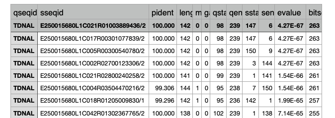
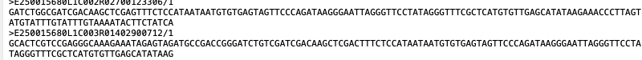
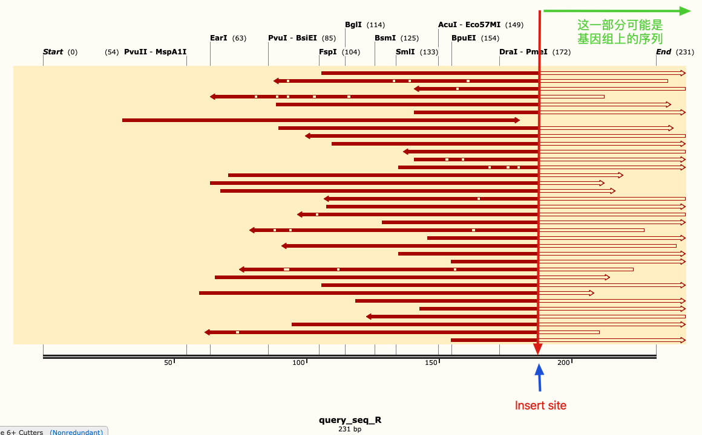

> 需解决的问题：转基因株系出现某种表型，发现可能是因为转基因片段插入，导致某个基因功能缺失。那么具体插在哪条染色体和那个基因，通过全基因组重测序，分析插入位点。

# 1. 准备分析环境，安装所需软件
```
# macOS安装miniconda
brew install --cask miniconda
```
# 2. 创建新的Conda环境
创建一个名为 tomato_reseq 的新环境，并激活它：
```
# 添加bioconda和conda-forge频道
conda config --add channels defaults
conda config --add channels bioconda
conda config --add channels conda-forge

# 安装所需软件
conda install -c bioconda blast seqtk


# 激活环境
conda activate tomato_reseq

# 关闭环境
conda deactivate
```

# 3. 将fq文件转换为fa文件，方便分析
R1和R2.clean.fq.gz是测序公司返还的双端测序结果，且是经过质检和过滤的clean data

```
seqtk seq -a R1.clean.fq.gz > output_R1.fa
seqtk seq -a R2.clean.fq.gz > output_R2.fa
```

# 4. 将双端测序结果fa文件合并为同一个文件,并构建本地blast数据库

{}
由于重测序数据非常大，可能有50几个G。在构建本地数据库的时候，个人电脑通常需要几个小时，耐心等待。
{}

```
cat output_R1.fa output_R2.fa > combined_R1_R2.fa

# 构建本地blast数据库
makeblastdb -in combined_R1_R2.fa -dbtype nucl -out combined_db
```

# 5. 进行 BLAST 比对

接下来，使用你的转基因片段作为 query，去和你创建的数据库进行比对。这里是 blastn 命令的示例：

```
blastn -query transgene.fa -db combined_db -out blast_results.txt -evalue 1e-5 -outfmt 6
```
参数解释：

- query: 您的查询序列文件
- db: BLAST 数据库名称
- out: 输出文件名
- evalue: E-value 阈值，这里设置为 1e-5
- outfmt 6: 输出格式，6 表示表格形式，易于解析

# 6. blast_results结果解析
通常是一下这种格式，有非常多的参数。


输出格式说明：
默认的 outfmt 6 格式包含以下列：

	•	qseqid: 查询序列 ID（你用来比对的序列）
	•	sseqid: 目标序列 ID（来自数据库中的序列）
	•	pident: 相似百分比
	•	length: 比对长度
	•	qstart 和 qend: 查询序列中比对部分的起始和终止位置
	•	sstart 和 send: 数据库序列中比对部分的起始和终止位置
	•	evalue: 期望值（用于判断比对的显著性）
	•	bitscore: 比对得分（越高越好）

# 7. 筛选部分百分百比对上的sseqid，提取序列
推荐使用 seqtk：
- a. 首先，创建一个包含所有您想提取的read ID的文本文件，每行一个ID。例如，创建一个名为 read_ids.txt 的文件：

```
E250015680L1C025R00402686602/2
E250015680L1C035R04204894351/2
E250015680L1C035R03903766244/2
```
- b. 然后使用以下命令：
combined.fa是合并R1和R2双端测序的数据集
```
seqtk subseq combined.fa read_ids.txt > extracted_reads.fa
```
- c. 得到这样的结果，序列都是150bp



# 8. 将这个提取数据集map到你的转基因片段
你可能会得到如下结果，大概就能找到插入的位点。选择你的基因组序列，再比对到你的物种基因组上，大概就能定位到基因。


