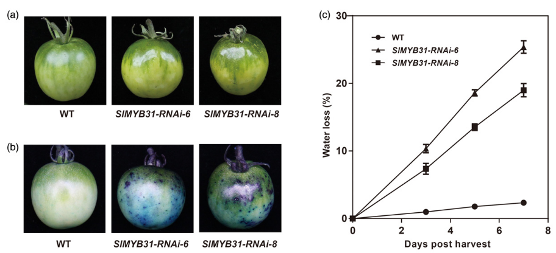
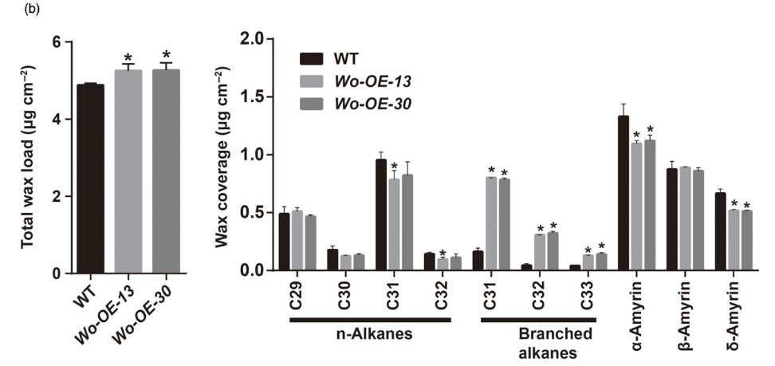
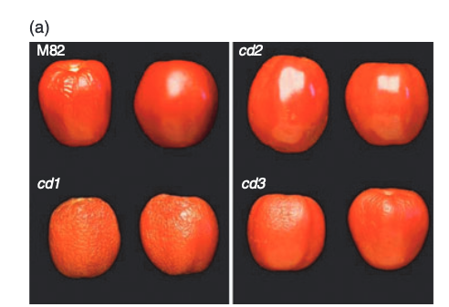
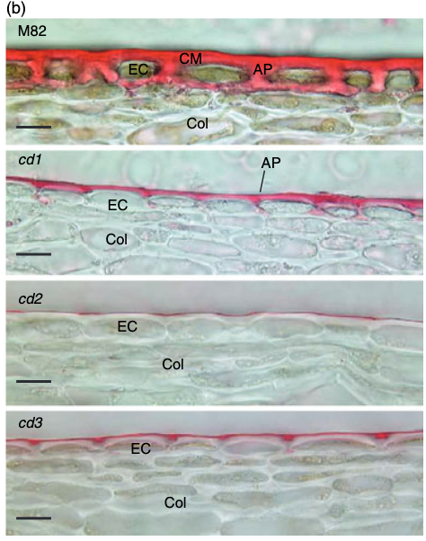
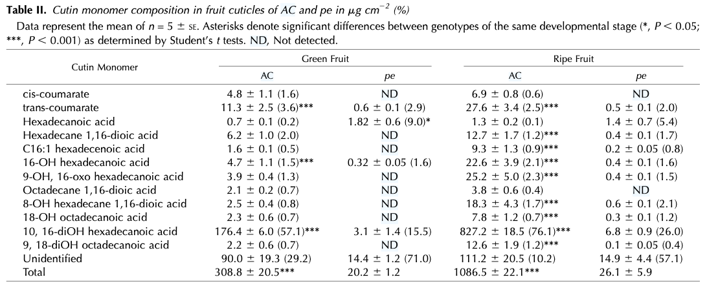
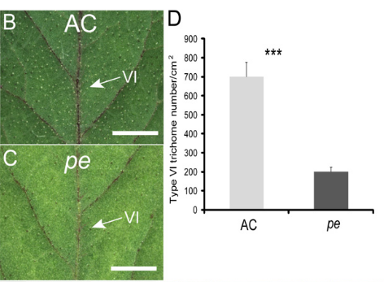
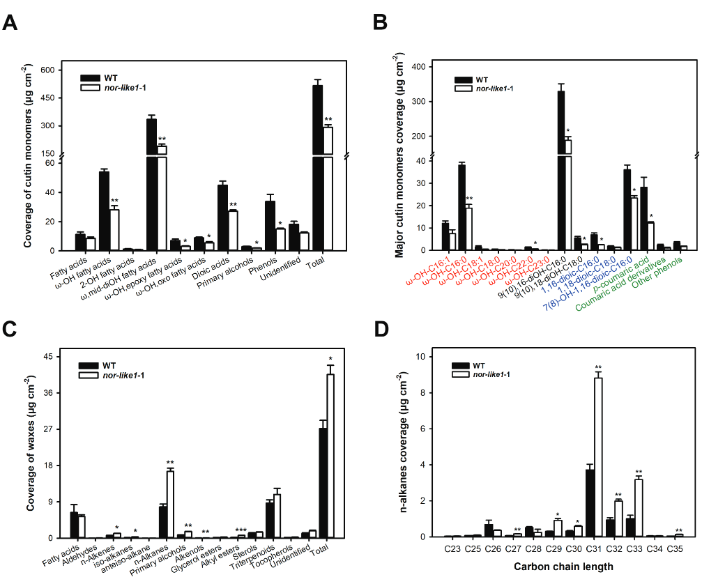
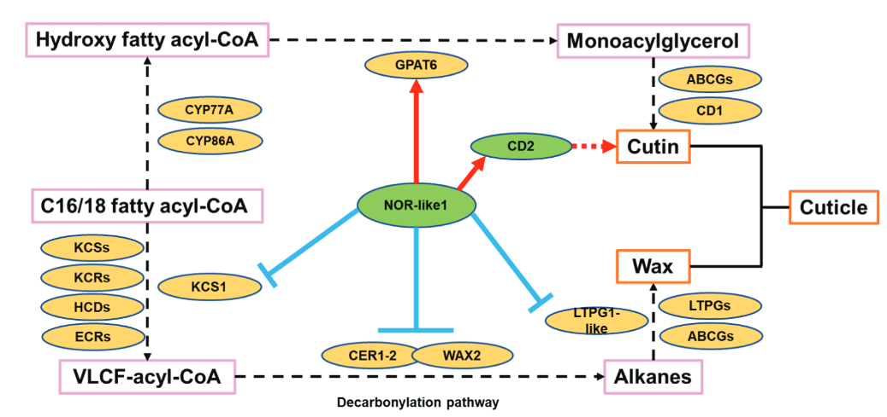

# SlMYB31, Solyc03g116100; Wo, Solyc02g080260; SlCER6, Solyc02g085870
Function: Cuticular wax biosynthesis

Original Article： Xiong C, Xie Q, Yang Q, Sun P, Gao S, Li H, Zhang J, Wang T, Ye Z, and Yang C. WOOLLY, interacting with MYB transcription factor MYB31, regulates cuticular wax biosynthesis by modulating CER6 expression in tomato. Plant J. 2020:103(1):323–337. https://doi.org/10.1111/tpj.14733

# SlCD2，Solyc01g091630
Function：Reduced cutin content and altered wax composition

Original Article 1： Isaacson T, Kosma DK, Matas AJ, Buda GJ, He Y, Yu B, Pravitasari A, Batteas JD, Stark RE, Jenks MA, et al. Cutin deficiency in the tomato fruit cuticle consistently affects resistance to microbial infection and biomechanical properties, but not transpirational water loss. The Plant Journal. 2009:60(2):363–377. https://doi.org/10.1111/j.1365-313X.2009.03969.x

Original Article 2： 
Nadakuduti SS, Pollard M, Kosma DK, Allen C, Ohlrogge JB, and Barry CS. Pleiotropic Phenotypes of the sticky peel Mutant Provide New Insight into the Role of CUTIN DEFICIENT2 in Epidermal Cell Function in Tomato. Plant Physiology. 2012:159(3):945–960. https://doi.org/10.1104/pp.112.198374

# SlNOR-like1，Solyc07g063420

Function：：Reduced cutin deposition and cuticle thickness, with a microcracking phenotype, while wax accumulation was promoted in mutant.

Original Article 2： Liu G-S, Huang H, Grierson D, Gao Y, Ji X, Peng Z-Z, Li H-L, Niu X-L, Jia W, He J-L, et al. NAC transcription factor SlNOR-like1 plays a dual regulatory role in tomato fruit cuticle formation. J Exp Bot. 2023:erad410. https://doi.org/10.1093/jxb/erad410

